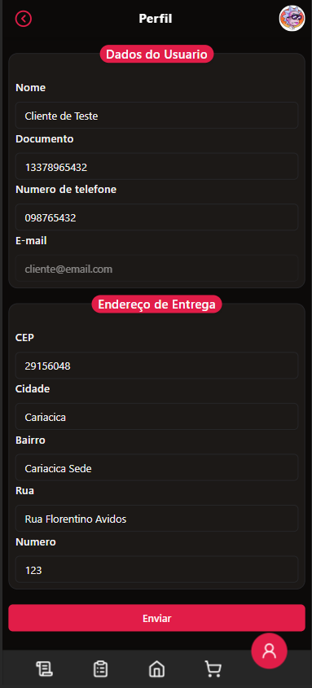
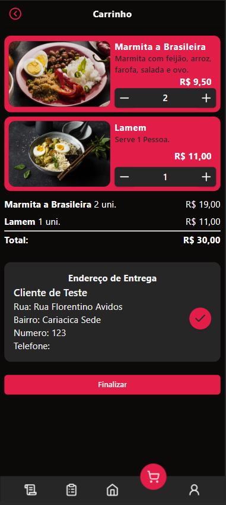

# React + TypeScript + Vite + Zod + Form






* Para rodar o projeto, abra o terminal e digite:

```js
  cd backend
```
```js 
  npm i
```
```js 
  npm run start:dev
```

* Abra outro terminal e digite: 

```js 
  npm i
```
```js 
  npm run dev
```
